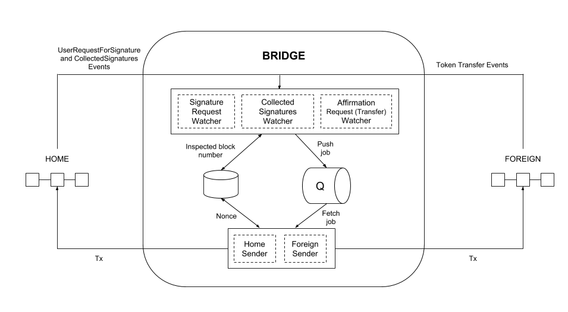

# TokenBridge

The TokenBridge is deployed on specified validator nodes (only nodes whose private keys correspond to addresses specified in the smart contracts) in the network. It connects to two chains via a Remote Procedure Call (RPC) and is responsible for:
- listening to events related to bridge contracts
- sending transactions to authorize asset transfers

## General Bridge Overview

The Bridge allows users to transfer assets between two chains in the Ethereum ecosystem. This is a customized version of [POA network Bridge](https://github.com/poanetwork/tokenbridge).

**Bridge Elements**
1. The TokenBridge contained in this repository.
2. [Solidity smart contracts](./contracts). Used to manage bridge validators, collect signatures, and confirm asset relay and disposal.
3. [Bridge UI Application](./ui). A DApp interface to transfer tokens and coins between chains.
4. [Bridge Monitor](./monitor). A tool for checking balances and unprocessed events in bridged networks.
5. [Bridge Deployment](./deployment). Manages configuration instructions for deployment.

## Network Definitions

 Bridging occurs between two networks.

 * **Home** - is a network with fast and inexpensive operations. All bridge operations to collect validator confirmations are performed on this side of the bridge.

* **Foreign** can be any chain; generally it refers to the Ethereum mainnet. 

## Operational Modes

The TokenBridge provides next operational mode:

- [x] `ERC20-to-ERC20` ERC20-compatible tokens on the Foreign network are locked and minted as ERC20-compatible tokens (ERC677 tokens) on the Home network. When transferred from Home to Foreign, they are burnt on the Home side and unlocked in the Foreign network. This can be considered a form of atomic swap when a user swaps the token "X" in network "A" to the token "Y" in network "B".

## Architecture

### ERC20-to-ERC20

### Watcher
A watcher listens for a certain event and creates proper jobs in the queue. These jobs contain the transaction data (without the nonce) and the transaction hash for the related event. The watcher runs on a given frequency, keeping track of the last processed block.

If the watcher observes that the transaction data cannot be prepared, which generally means that the corresponding method of the bridge contract cannot be invoked, it inspects the contract state to identify the potential reason for failure and records this in the logs. 

There are three Watchers:
- **Signature Request Watcher**: Listens to `UserRequestForSignature` events on the Home network.
- **Collected Signatures Watcher**: Listens to `CollectedSignatures` events on the Home network.
- **Affirmation Request Watcher**: Listens to `Transfer` events raised by the token contract.

### Sender
A sender subscribes to the queue and keeps track of the nonce. It takes jobs from the queue, extracts transaction data, adds the proper nonce, and sends it to the network.

There are two Senders:
- **Home Sender**: Sends a transaction to the `Home` network.
- **Foreign Sender**: Sends a transaction to the `Foreign` network.

### RabbitMQ

[RabbitMQ](https://www.rabbitmq.com/) is used to transmit jobs from watchers to senders.

### Redis DB

Redis is used to store the number of blocks that were already inspected by watchers, and the Nonce (Number of Operation) which was used previously by the sender to send a transaction.

# How to Use

## Installation and Deployment

#### Deploy the Bridge Contracts

Go to [deployment](./deployment) folder and follow instructions in **Contracts** section.

### Run Validator software 

Go to [deployment](./deployment) folder and follow instructions in **Validator** section.

### Run Bridge UI

Go to [deployment](./deployment) folder and follow instructions in **User interface** section.

## License

This project is licensed under the GNU Lesser General Public License v3.0. See the [LICENSE](LICENSE) file for details.